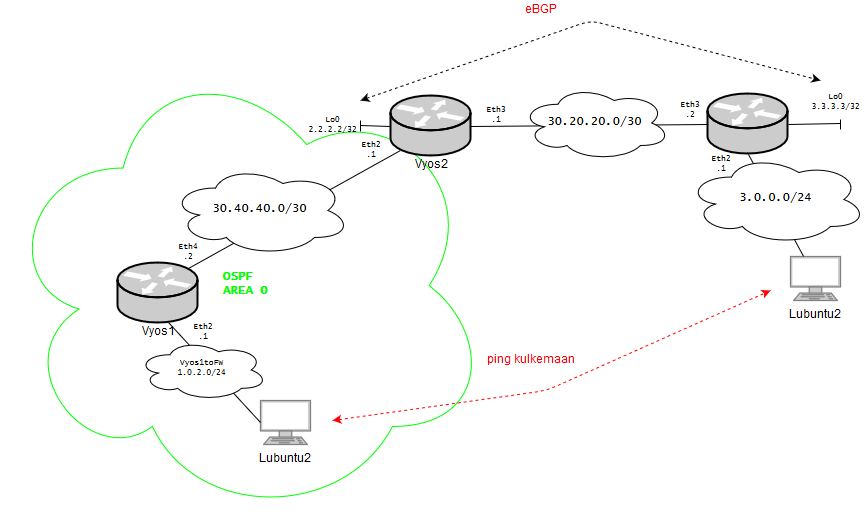

# Harjoitustehtävä

[http://draw.io](http://draw.io/) -palvelussa voi muokata [topologiakuvaa](src/Harjoitteet/Harjoitus2.png).

Asenna 3 [VyOS -reititintä](http://vyos.io) ja kaksi Lubuntua.
1. Tee eBGP naapuruus topologian mukaisesti VyOS2 <-> VyOS3 reitittimien Loopbackien välille. 
2. Lisää OSPF Area 0 VyOS1 & VyOS2 välille.
3. Mainosta aliverkko 3.0.0.0/24 BGP:ssä.
4. Mainosta 1.0.2.0/24 aliverkko OSPF:ssä.
5. Redistributea reititysprotokollien välillä verkot.
6. Pingaa onnistuneesti Lubuntujen välillä. 
